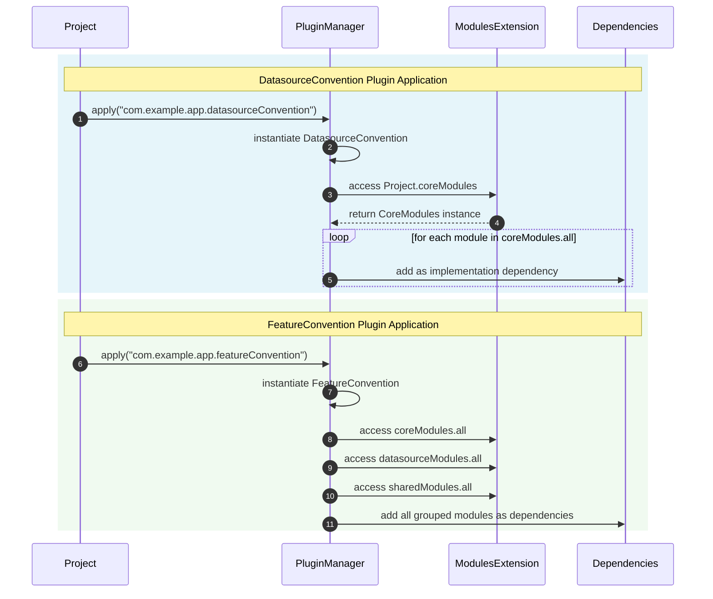

# KleanBoy

**KleanBoy** is a Kotlin Multiplatform (KMP) multi-module project template built on **Clean Architecture** and powered by **custom Gradle plugins**.

It’s designed for Android and KMP engineers who love building apps but hate boilerplate setup.

---

## 🧩 Overview

KleanBoy provides a ready-to-code structure with build logic preloaded for:

- Custom Gradle conventions

- Modularized features and data sources

- Shared KMP setup for Android and other platforms


The included plugins automate module wiring — letting you focus on app logic, not Gradle files.

---

## 🔁 How It Works



---

## 🧰 Usage & Refactor Checklist

When adapting KleanBoy for your project, update the following to avoid runtime or build errors:

### a. `gradle.properties`

Holds your app metadata:

```properties
# App identity  
appPackagePrefix=com.example  
appPackageName=app  
appName=KleanBoy
```

Referenced in `AppIdentity.kt` (`build-logic/convention/src/main/kotlin/AppIdentity.kt`).

---

### b. `build-logic/convention/build.gradle.kts`

Defines and registers custom Gradle plugins:

```kotlin
val moduleName = "com.example.app" // your module name
group = "$moduleName.buildlogic"

gradlePlugin {
    plugins {
        register("kotlinMultiplatformLibrary") {
            id = "$moduleName.kotlinMultiplatformLibrary"
            implementationClass = "$moduleName.KotlinMultiplatformLibrary"
        }
        register("featureConvention") {
            id = "$moduleName.featureConvention"
            implementationClass = "$moduleName.FeatureConvention"
        }
        register("datasourceConvention") {
            id = "$moduleName.datasourceConvention"
            implementationClass = "$moduleName.DatasourceConvention"
        }
        // ...and others
    }
}

dependencies {
    compileOnly(libs.android.gradlePlugin)
    compileOnly(libs.kotlin.gradlePlugin)
    compileOnly(libs.compose.gradlePlugin)
}
```

---

### c. `gradle/libs.versions.toml`

Maps plugin IDs to the Gradle plugin versions:

```toml
# Custom app plugins
composeMultiplatformPlugin = { id = "com.example.app.composeMultiplatformPlugin", version = "unspecified" }
kotlinMultiplatformLibrary = { id = "com.example.app.kotlinMultiplatformLibrary", version = "unspecified" }
featureConvention = { id = "com.example.app.featureConvention", version = "unspecified" }
datasourceConvention = { id = "com.example.app.datasourceConvention", version = "unspecified" }
```

---
### d. `composeApp/src/androidMain/res/values/strings.xml`

This holds the app name for android build

```xml
<resources>  
    <string name="app_name">KleanBoy</string>  
</resources>
```


---
### e. Module Package Names

Ensure all module package names reflect your chosen namespace:

```kotlin
package com.example.app  // update this
```

🔹 **Pro tip:** Use `Shift + F6` in Android Studio to rename each package segment (directories update automatically).

---

## 📚 Documentation

See the [full plugin documentation](build-logic/README.md) for detailed explanations of each convention and its purpose.