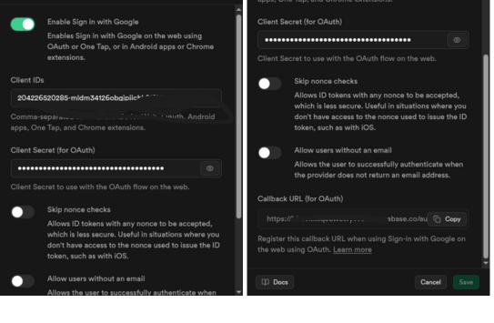
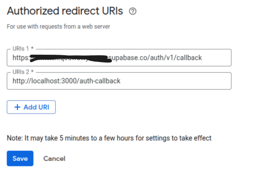

<p align="center">
  
</p>

<h1 align="center">Set up authentication</h1>

The game uses Supabase for profile management and high score tracking (at least at the time of writing this, it intends to).

## 1. Set up Supabase

The first step is creating your Supabase project, copying your `SUPABASE_URL` and `ANON_KEY`, and adding them to your `local.properties` in your forked project:

```properties
SUPABASE_KEY=ey*******
SUPABASE_URL=https://*****.supabase.co
```

## 2. Google Auth

Next, create a **Web Client** for Google Sign-In.

Copy your **Web ID** and **Client Secret** to your Supabase provider settings.

<p align="center">
  
</p>

## 3. Copy the callback URL

Copy the callback URL from the screenshot above and add it to your Google Cloud Web Client configuration under the first field.

<p align="center">
  
</p>

## 4. Copy the redirect URL

For successful authentication, add the app's intent URLs — i.e., `localhost` for PC and `gondi://auth` for Android — as shown below.

<p align="center">
  
</p>

Now your fork's authentication should be fully functional.

### Edit*
Also add this to your redirect urls

```
http://localhost:3000/auth-callback
```
